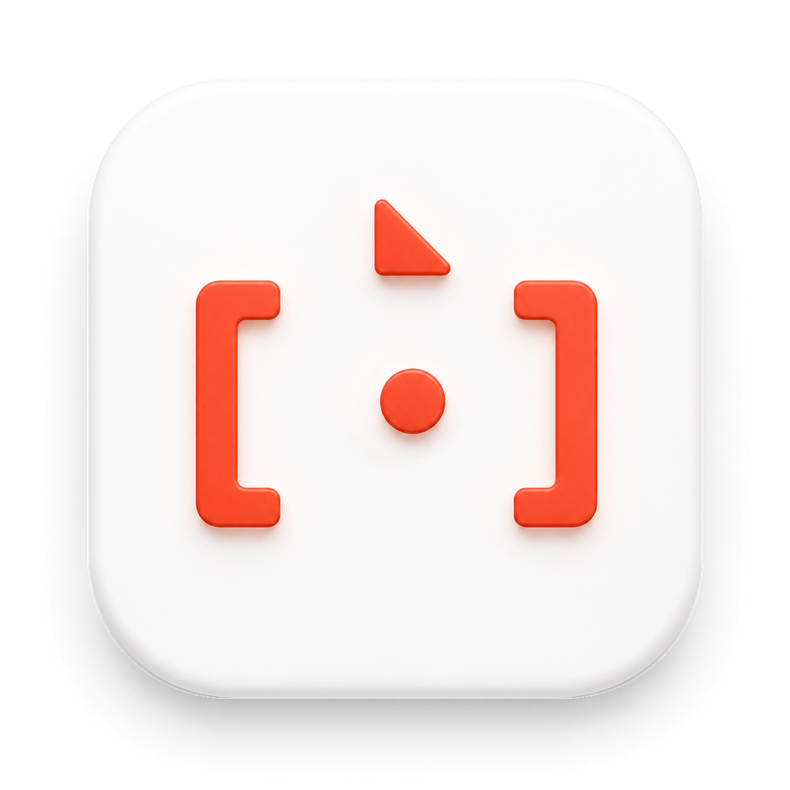
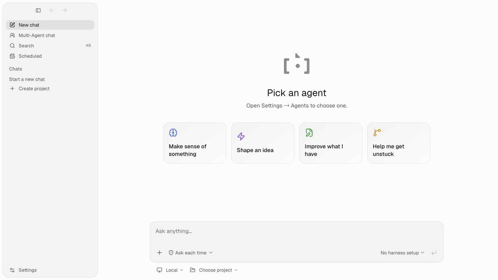
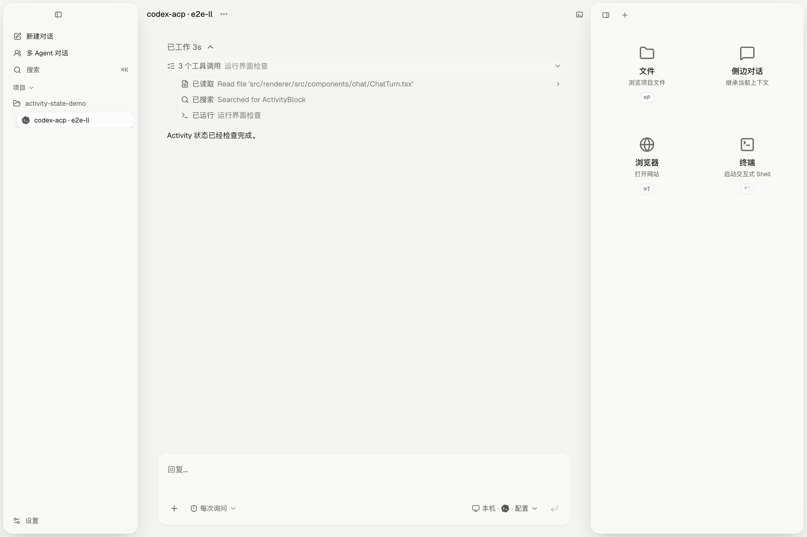
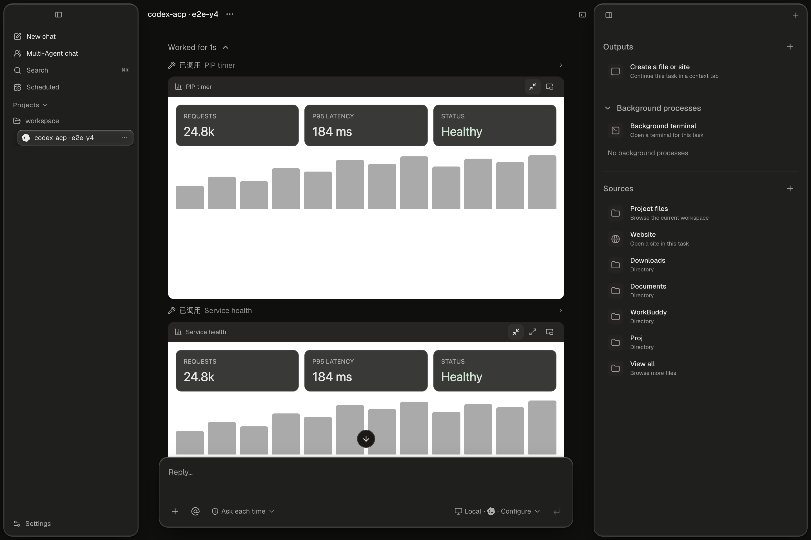
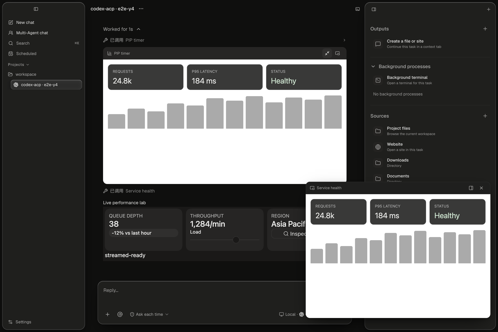
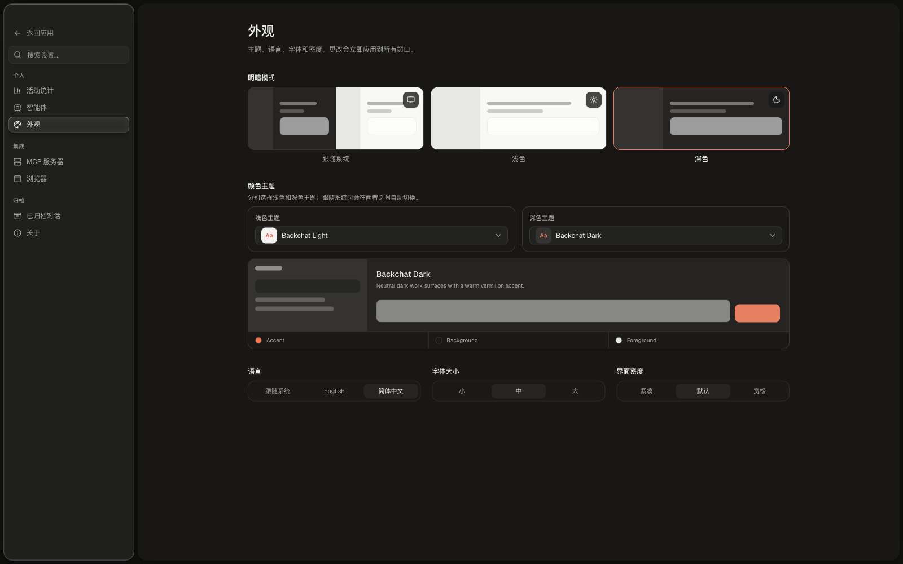

<p align="center">
  
</p>

<h1 align="center">Backchat</h1>

<p align="center">
  <strong>A calm, local-first desktop workspace for Agent Client Protocol (ACP) agents.</strong>
</p>

Backchat gives developer agents a shared desktop without taking away the things
that make each harness useful. Choose a project, choose an agent, and keep the
conversation, tools, files, browser, and terminal in one place.

<p align="center">
  
</p>

## Why Backchat

- **One workspace, many agents.** Run Claude Code, Codex CLI, Gemini CLI,
  OpenCode, Hermes, or OpenClaw from the same desktop surface.
- **Local-first by default.** Prompts, transcripts, project metadata, and local
  app state stay on your machine. The selected agent is responsible for talking
  to its model provider.
- **Agent-aware, not vendor-shaped.** Backchat surfaces the capabilities,
  commands, models, modes, and permissions reported by the active harness
  instead of inventing a generic capability layer.
- **Project-scoped context.** Sessions are grouped by their working directory,
  so files, terminals, browser state, and conversations stay attached to the
  project where the work happened.
- **Tools that stay in the flow.** Configure MCP servers once and use them from
  every session. Open a browser, inspect files, start a terminal, attach images,
  and render interactive MCP Apps without leaving the conversation.
- **Parallel thinking.** Use multi-agent chats, side chats, ACP forks, and
  native subagent activity when the underlying harness exposes it.
- **Repeatable work.** Create one-time or recurring schedules that run against a
  project and harness, with local run history.

## A few things you can see

These are representative UI snapshots from the current artifact/E2E suite.

<table>
  <tr>
    <td width="50%">
      
      <p align="center"><sub>Readable activity history with grouped tool calls.</sub></p>
    </td>
    <td width="50%">
      
      <p align="center"><sub>Interactive MCP Apps rendered directly in a turn.</sub></p>
    </td>
  </tr>
  <tr>
    <td width="50%">
      
      <p align="center"><sub>Pop out a live result when the work needs more room.</sub></p>
    </td>
    <td width="50%">
      
      <p align="center"><sub>Theme, language, density, and font settings are first-class.</sub></p>
    </td>
  </tr>
</table>

## Supported agents

Backchat currently ships registry entries for:

| Agent | ACP entry | Notes |
| --- | --- | --- |
| Claude Code | `claude-acp` | Claude Code through the official ACP adapter |
| Codex CLI | `codex-acp` | Codex through `codex-acp` |
| Gemini CLI | `gemini` | Gemini CLI's ACP mode |
| OpenCode | `opencode` | OpenCode's ACP mode |
| Hermes | `hermes` | Hermes ACP entry |
| OpenClaw | `openclaw` | OpenClaw ACP entry |

Agent binaries are discovered or configured from **Settings → Agents**. The
registry and setup layer are deliberately separate from the chat UI, so adding
or updating a harness does not require changing the conversation model.

## Quick start

### Run from source

Requirements: Node.js 20 or newer and [pnpm](https://pnpm.io/).

```bash
git clone https://github.com/openma-ai/backchat.git
cd backchat
pnpm install
pnpm dev
```

On first launch, open **Settings → Agents** to install or point Backchat at an
ACP-compatible agent, then choose a project and start a chat.

### Build and package

```bash
pnpm build          # production renderer/main bundles
pnpm package:local  # unsigned local installer
pnpm package:dir    # unpacked app directory
```

Signed release packaging and notarization are documented in
[`docs/releasing.md`](docs/releasing.md).

## Development commands

```bash
pnpm typecheck
pnpm test
pnpm test:e2e:fast
pnpm test:verify    # typecheck + unit tests + fast E2E lane
```

The desktop shell is built with Electron, TypeScript, React, Vite, Tailwind
CSS, and shadcn/ui. The ACP runtime is vendored from
[`open-managed-agents`](https://github.com/open-ma/open-managed-agents) and
trimmed to the local desktop use case.

## How the pieces fit together

1. **Choose a project.** A project is a working directory and the anchor for
   sessions and local artifacts.
2. **Choose a harness.** Backchat starts the selected ACP agent as a local
   child process and keeps its real configuration and capabilities visible.
3. **Work in one surface.** Conversation events, tool activity, MCP Apps,
   files, browser tabs, and terminals are projected into the same task.
4. **Branch when useful.** Continue in a side chat, fork an ACP session when
   supported, or follow native subagent activity emitted by the harness.

## Status

Backchat is **pre-release** and under active development. The product shape,
packaging, persistence format, and ACP integration surface may change before a
stable release. It is ready for local evaluation and development, not yet a
promise of backwards compatibility.

Issues and focused pull requests are welcome. For a useful bug report, include
your OS, Backchat build, agent/harness, project type, and the smallest reliable
reproduction.

## Learn more

- [Agent Client Protocol](https://agentclientprotocol.com/)
- [ACP session and subagent model](docs/session-subagent-levels.md)
- [Codex / ChatGPT plugin compatibility](docs/codex-plugin-compatibility-spec.md)
- [File-first storage RFC](docs/file-first-storage-rfc.md)
- [Release and signing guide](docs/releasing.md)
