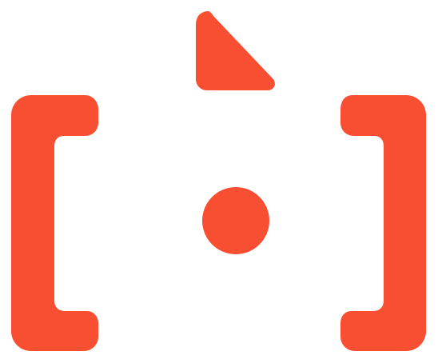

<p align="center">
  
</p>

<h1 align="center">Backchat</h1>

<p align="center">
  <a href="https://github.com/openma-ai/deepseek-harness-acp"></a>
  
  
  
</p>

<p align="center">
  <strong>A multi-agent desktop for Agent Client Protocol (ACP) harnesses, tools, and outputs.</strong>
</p>

<p align="center">
  <a href="https://backchat.openma.dev/"><strong>Visit the official website →</strong></a>
</p>

<p align="center">
  <strong>New: <a href="https://github.com/openma-ai/deepseek-harness-acp">DeepSeek Harness</a> support through <code>dsh-plugin</code> and <code>dsh-acp</code>.</strong><br />
  <sub>Use your existing dsh profile or the standalone ACP server from the same desktop.</sub>
</p>

Backchat gives developer agents a shared desktop without taking away the things
that make each harness useful. Bring multiple agents into one conversation and
keep the built-in browser, files, terminal, MCP Apps, and Codex plugins close.

<p align="center">
  
</p>

## Why Backchat

- **One workspace, many agents.** Run Claude Code, Codex CLI, DeepSeek Harness,
  Gemini CLI, OpenCode, Hermes, or OpenClaw from the same desktop surface.
- **Agent-aware, not vendor-shaped.** Backchat surfaces the capabilities,
  commands, models, modes, and permissions reported by the active harness
  instead of inventing a generic capability layer.
- **Project-scoped context.** Sessions are grouped by their working directory,
  so files, terminals, browser state, and conversations stay attached to the
  project where the work happened.
- **Projects can span related folders.** One primary folder supplies the chat
  cwd, Git context, and project instructions; secondary folders extend the
  agent's file scope through ACP `additionalDirectories`.
- **Built-in tools that stay in the flow.** Browse the web, inspect files, start
  a terminal, attach images, and work without leaving the conversation.
- **Native extensions and apps.** Render interactive MCP Apps directly in a
  turn and use Codex plugins without flattening them into generic text output.
- **Multi-agent conversations.** Bring several harnesses into one chat, or use
  side chats, ACP forks, and native subagent activity when available.
- **Repeatable work.** Create one-time or recurring schedules that run against a
  project and harness, with local run history.

## A few things you can see

These are representative UI snapshots from the current artifact/E2E suite.

<table>
  <tr>
    <td width="50%">
      
      <p align="center"><sub>Readable activity history with grouped tool calls.</sub></p>
    </td>
    <td width="50%">
      
      <p align="center"><sub>Interactive MCP Apps rendered directly in a turn.</sub></p>
    </td>
  </tr>
  <tr>
    <td width="50%">
      
      <p align="center"><sub>Pop out a live result when the work needs more room.</sub></p>
    </td>
    <td width="50%">
      
      <p align="center"><sub>Theme, language, density, and font settings are first-class.</sub></p>
    </td>
  </tr>
</table>

## Supported agents

Backchat currently ships registry entries for:

| Agent | ACP entry | Notes |
| --- | --- | --- |
| Claude Code | `claude-acp` | Claude Code through the official ACP adapter |
| Codex CLI | `codex-acp` | Codex through `codex-acp` |
| [DeepSeek Harness](https://github.com/openma-ai/deepseek-harness-acp) | `dsh-acp` or `dsh --profile acp` | Standalone ACP server or dsh profile plugin |
| Gemini CLI | `gemini` | Gemini CLI's ACP mode |
| OpenCode | `opencode` | OpenCode's ACP mode |
| Hermes | `hermes` | Hermes ACP entry |
| OpenClaw | `openclaw` | OpenClaw ACP entry |

DeepSeek Harness can be connected in either form:

```bash
# Standalone ACP server
npm install -g @openma/deepseek-harness-acp
dsh-acp login

# Or install it into an existing dsh profile
dsh plugin --profile acp add -w @openma/deepseek-harness-acp
```

See [openma-ai/deepseek-harness-acp](https://github.com/openma-ai/deepseek-harness-acp)
for authentication, profile, model, permission, and MCP configuration.

Agent binaries are discovered or configured from **Settings → Agents**. The
registry and setup layer are deliberately separate from the chat UI, so adding
or updating a harness does not require changing the conversation model.

## Quick start

### Run from source

Requirements: Node.js 20 or newer and [pnpm](https://pnpm.io/).

```bash
git clone https://github.com/openma-ai/backchat.git
cd backchat
pnpm install
pnpm dev
```

On first launch, open **Settings → Agents** to install or point Backchat at an
ACP-compatible agent, then choose a project and start a chat.

### Build and package

```bash
pnpm build          # production renderer/main bundles
pnpm package        # unsigned local installer for the current OS
pnpm package:dir    # unpacked app directory
```

Signed release packaging and notarization are documented in
[`docs/releasing.md`](docs/releasing.md).

## Development commands

```bash
pnpm typecheck
pnpm test:ci        # curated contract + release-regression lane (GitHub Actions)
pnpm test
pnpm test:e2e:fast
pnpm test:verify    # typecheck + full unit tests + fast E2E lane
```

Pull requests run `test:ci` and `test:e2e:fast`. Pushes to `main` also build an
unsigned macOS DMG, then check that the packaged app can import its runtime and
complete a first prompt. The website download button always points at
https://github.com/openma-ai/backchat/releases/latest/download/Backchat-arm64.dmg
; tagged releases upload that stable filename next to the versioned DMG.
GitHub's official Dependency Review, CodeQL, and Dependabot for Actions run
alongside those gates.

The desktop shell is built with Electron, TypeScript, React, Vite, Tailwind
CSS, and shadcn/ui. The ACP runtime is vendored from
[`open-managed-agents`](https://github.com/open-ma/open-managed-agents) and
trimmed to the local desktop use case.

## How the pieces fit together

1. **Choose a project.** A project is a working directory and the anchor for
   sessions and local artifacts.
2. **Choose a harness.** Backchat starts the selected ACP agent as a local
   child process and keeps its real configuration and capabilities visible.
3. **Work in one surface.** Conversation events, tool activity, MCP Apps,
   files, browser tabs, and terminals are projected into the same task.
4. **Branch when useful.** Continue in a side chat, fork an ACP session when
   supported, or follow native subagent activity emitted by the harness.

## Status

Backchat is **pre-release** and under active development. The product shape,
packaging, persistence format, and ACP integration surface may change before a
stable release. It is ready for local evaluation and development, not yet a
promise of backwards compatibility.

Issues and focused pull requests are welcome. For a useful bug report, include
your OS, Backchat build, agent/harness, project type, and the smallest reliable
reproduction.

## Learn more

- [Agent Client Protocol](https://agentclientprotocol.com/)
- [ACP session and subagent model](docs/session-subagent-levels.md)
- [Codex / ChatGPT plugin compatibility](docs/codex-plugin-compatibility-spec.md)
- [File-first storage RFC](docs/file-first-storage-rfc.md)
- [Release and signing guide](docs/releasing.md)
