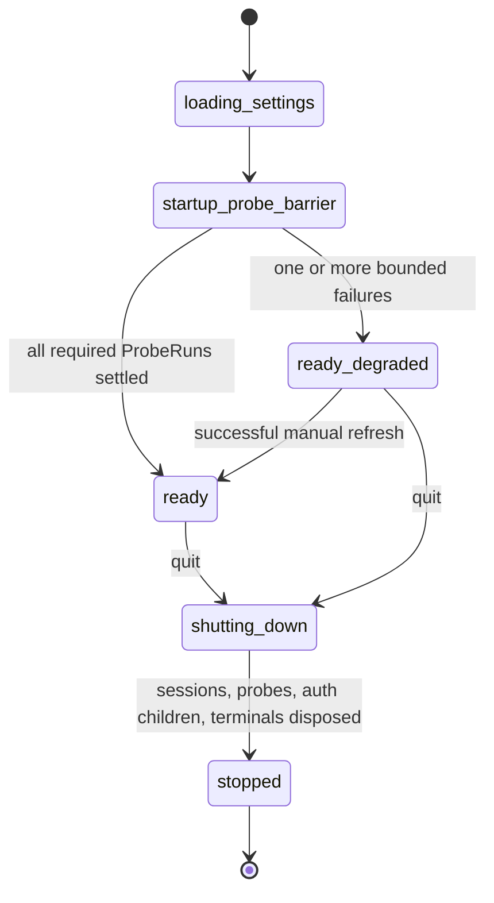
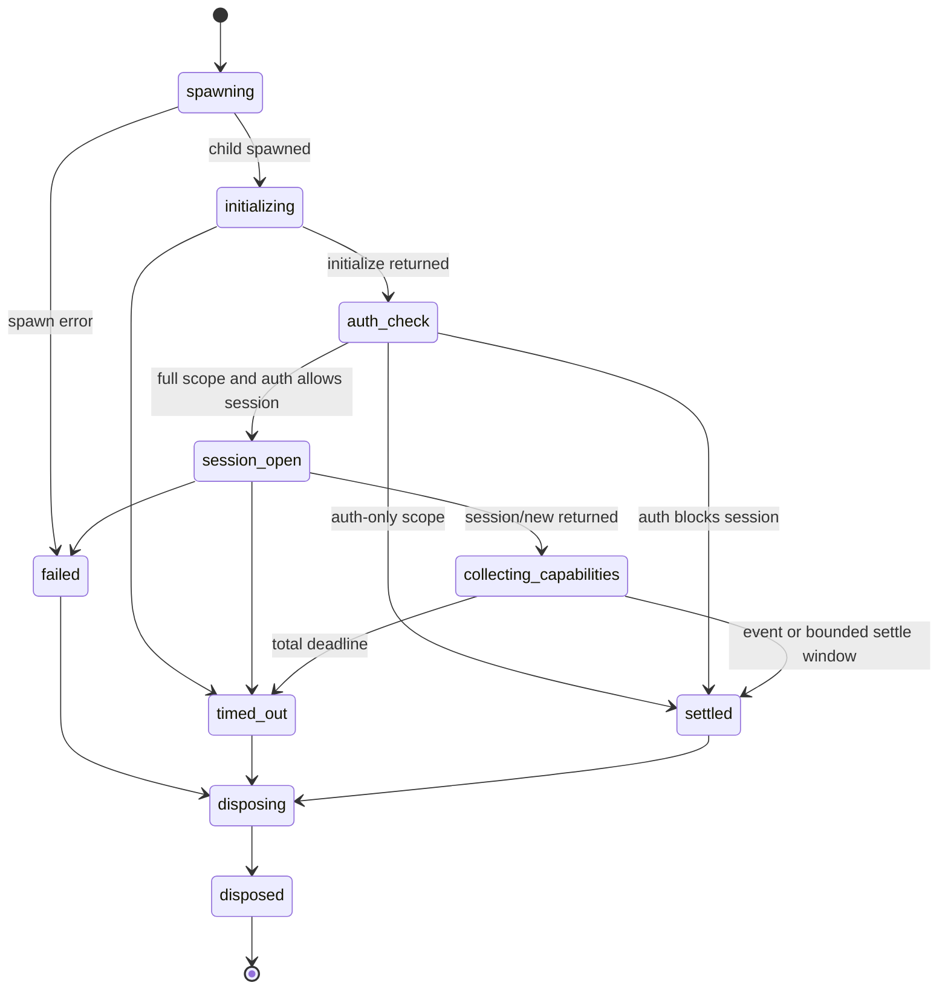
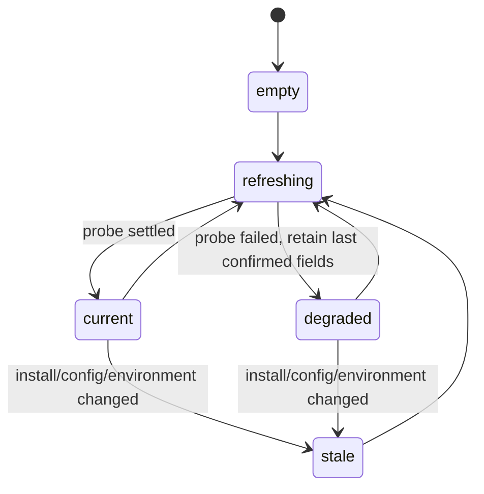
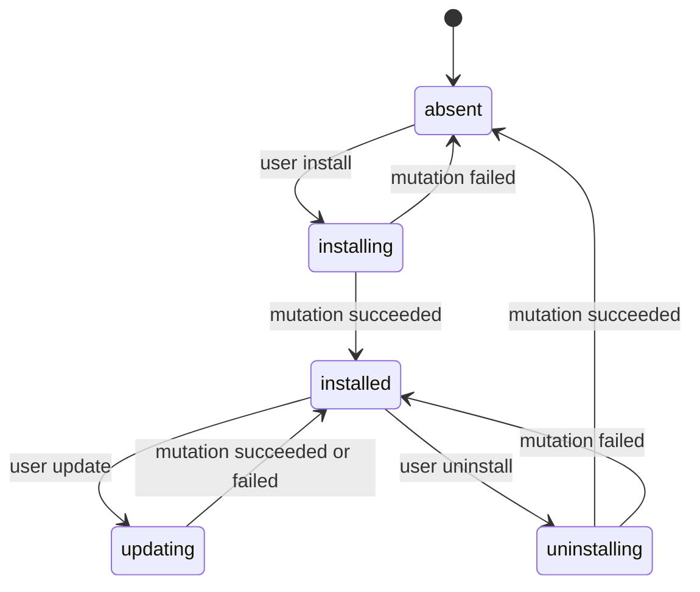
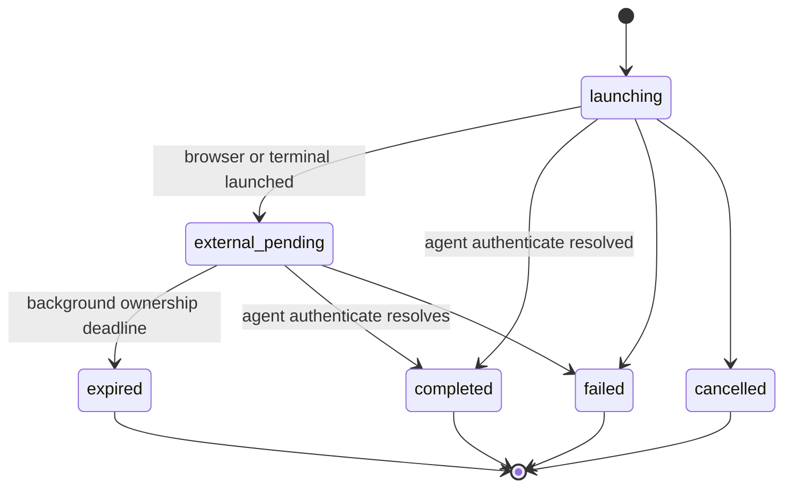
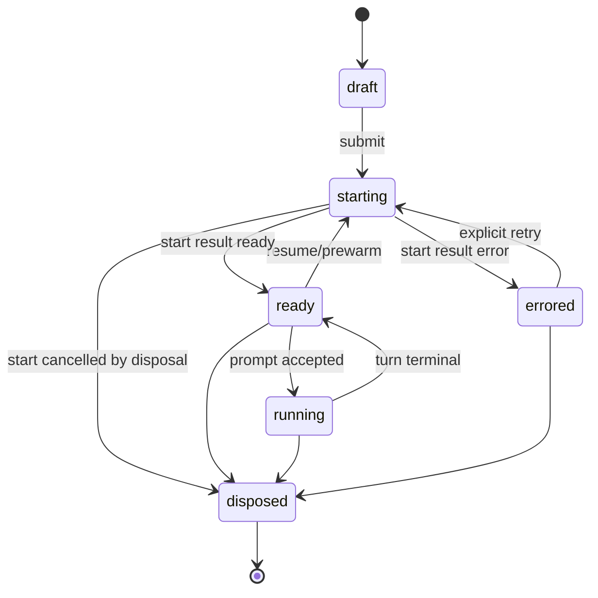
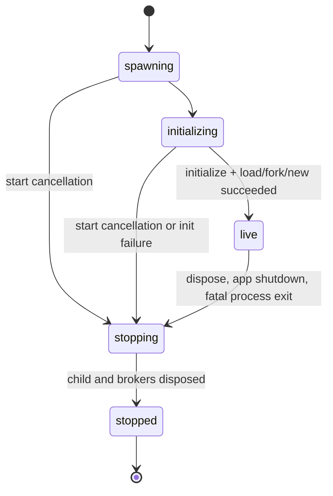
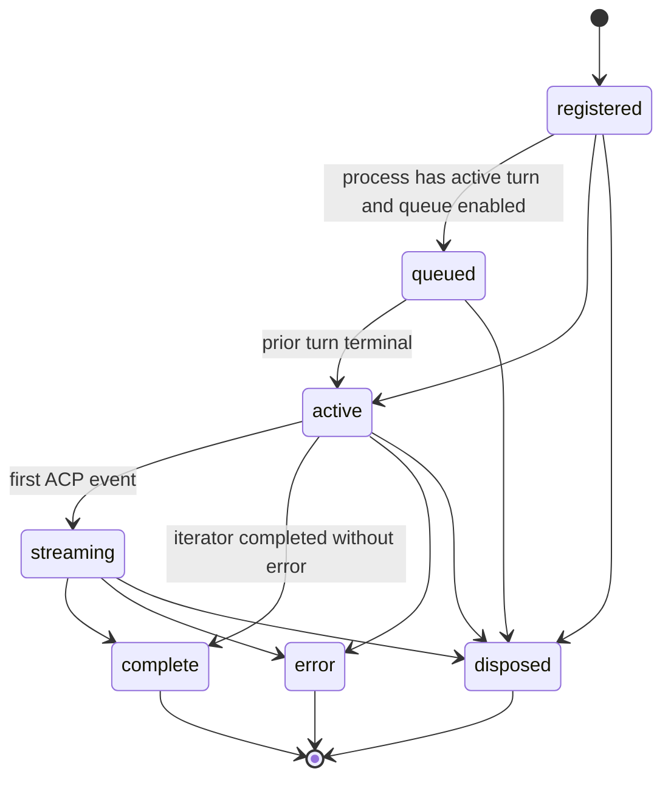
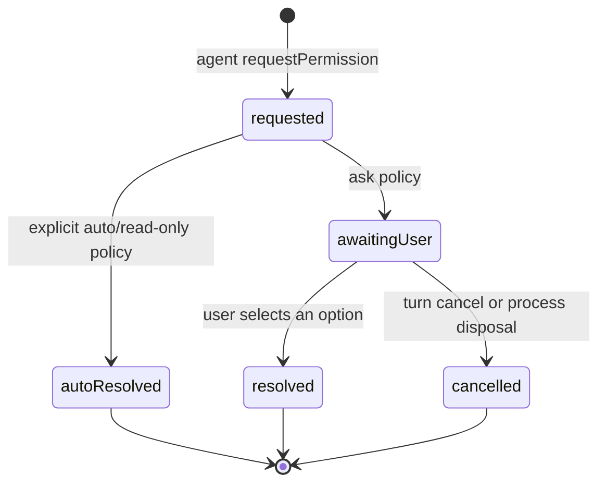

# Agent, Probe, and ACP Lifecycle Specification

Status: normative
Scope: Desktop main process, preload boundary, renderer state, setup service,
and ACP runtime.

This document is the source of truth. UI components render these states; they
do not infer or recreate them with timers, text matching, or route effects.

## 1. Entity model

The application has a small set of stateful entities. Triggers such as “cold
start” and “refresh” are operations, not entities.

| Entity | Identity | Owns | Does not own |
| --- | --- | --- | --- |
| `AppRuntime` | one per Electron process | startup barrier, shutdown barrier | agent/session details |
| `AgentInstallation` | agent id | absent/install/update filesystem state | auth and runtime session state |
| `AgentCapabilitySnapshot` | agent id | last inventory, auth, config, command, and mode facts | a live ACP child |
| `ProbeRun` | operation id + agent id | one disposable ACP child and its timeout | a real chat |
| `AuthAttempt` | operation id + agent id | one explicit sign-in flow | capability verification |
| `ChatSession` | OpenMA session id | persisted conversation and selected agent/workspace | ACP adapter internals |
| `AcpProcess` | ChatSession process generation | one long-lived ACP child/connection | renderer state |
| `Turn` | session id + turn id | queue/stream/terminal outcome | process installation |

The important separations are:

- inventory detection is not an ACP probe;
- an auth attempt is not an auth probe;
- a disposable probe process is not a real session process;
- `ChatSession` survives process disposal and can later resume with a new
  `AcpProcess` generation.

## 2. Global invariants

1. Real session start never probes, authenticates, installs, updates, refreshes
   a registry, or chooses an agent implicitly.
2. Cold startup does not declare agent/config readiness until its required
   probes settle.
3. Renderer code may request a semantic action such as manual refresh, but may
   not choose probe targets or compose probe scopes.
4. Each `ProbeRun` owns exactly one disposable child. Every terminal path
   disposes it.
5. Each ChatSession id owns at most one in-flight start and one live
   `AcpProcess` generation.
6. Disposal dominates all later events from the disposed generation.
7. A Turn has exactly one terminal outcome.
8. `session.start`'s structured IPC result is the synchronization contract.
   Push events mirror state for rendering; their arrival order is not a
   completion protocol.
9. Agent/model/effort selection is recent-run state. There is no static default
   agent.
10. Unknown ACP events are persisted and observable, never silently discarded.

## 3. AppRuntime



`ready_degraded` is usable and carries explicit failure metadata. A timeout must
not leave the app permanently in `startup_probe_barrier`.

While `startup_probe_barrier` is active, the renderer exposes only the
application-level animated loading surface. Routes, Sidebar, Settings, and
Composer are not mounted and persisted capability snapshots are not presented
as current state. When every required probe reaches a terminal state, the
renderer enters `ready` or `ready_degraded` and mounts the complete UI once.

`AgentsList` calls after mounting reuse the single startup result. They must not
start a second warmup.

## 4. Probe vocabulary and trigger matrix

There are four different operations that were previously all called “probe”:

- **catalog refresh**: update the installable-agent registry; may use network;
- **inventory detection**: inspect command/shim/install metadata; no ACP child;
- **auth probe**: disposable ACP initialize plus the minimum auth/session check;
- **capability probe**: auth probe, then disposable `session/new`, then collect
  config options, available commands, and modes.

| Trigger point | Catalog | Inventory | ACP scope | Target | Barrier |
| --- | --- | --- | --- | --- | --- |
| cold startup | refresh | all catalog entries | full capability | every detected agent | yes |
| ordinary run-selection list | cached | all catalog entries | none | none | awaits startup |
| Settings first paint | cached | all catalog entries | none | none | app barrier already settled |
| manual “refresh configuration” | refresh | all catalog entries | full capability | enabled ids | yes, for action |
| install success | operation already refreshed | target + list | full capability | installed id | yes, for action |
| update success | cached/operation policy | target + list | full capability | updated id | yes, for action |
| uninstall success | refresh | all catalog entries | none | none | yes, for action |
| explicit sign-in | cached | target availability | authentication flow, not probe | selected id | yes until launched/completed |
| chat create/open/resume/prewarm/start | none | selected command availability only | none | none | no probe |
| prompt/queue/steer/cancel/retry | none | none | none | none | no probe |
| timer/focus/remount/query refetch | none | none | none | none | none |

If manual refresh has no enabled agents, it performs catalog plus inventory
refresh and starts no ACP child.

The public renderer API exposes only `agentsList({ refresh: true })`.
Target selection and probe depth belong to the setup service.

## 5. ProbeRun and capability snapshots

### 5.1 ProbeRun state



The total deadline bounds spawn, initialize, session creation, and collection.
Auth-only inspection defaults to 15 seconds; full capability inspection
defaults to 30 seconds because it must also open a session. Capability
collection has a separate short settle window.
`available_commands_update` is optional: an agent that never emits it completes
normally with an empty command list. Absence must not consume the full probe
timeout or discard config already returned by `session/new`.

Disposal is idempotent and occurs on success, auth-required, unsupported auth,
throw, timeout, and cancellation. Probe children are never promoted into real
session children.

### 5.2 AgentCapabilitySnapshot state



A snapshot records provenance and time per field group:

- inventory: detected command, install metadata, version;
- auth: configured / needs-auth / unknown plus supported methods;
- capabilities: config options, commands, and modes.

Every attempted capability inspection also records an explicit terminal result:

- `ready`: `session/new` completed and capability fields are current;
- `blocked-auth`: initialize/auth completed, but authentication prevented
  `session/new` from exposing capabilities;
- `degraded`: the attempt failed or timed out; the error is retained for
  observability and any prior confirmed capability fields remain stale.

An attempted inspection must never be represented as an empty successful
capability set merely because an exception was caught.

Inventory is recomputed without starting ACP. Auth is an in-memory confirmed
fact. Capabilities may use the persisted probe cache. A transient failure keeps
the last confirmed values and marks the refresh degraded; it does not fabricate
new values.

## 6. AgentInstallation



After successful install/update, the operation runs one targeted full
`ProbeRun` before publishing the new snapshot. A mutation failure runs no
follow-up probe.

Session start must not fetch versions, install, repair, update, or silently
fall back to a different executable.

## 7. AuthAttempt



Authentication is an explicit action. It may launch an external browser or
terminal and return `external_pending`. OpenMA does not poll and does not run a
follow-up auth/capability probe. Manual refresh is the explicit verification
action; otherwise the next real session may return the runtime's actual auth
error.

An external-pending auth child has a bounded ownership deadline and is disposed
when authenticate settles, fails, is cancelled, expires, or the app shuts down.

## 8. Run selection and settings migration

For an unlocked composer:

```text
locked agent
  > explicit pick for this draft
  > agent already bound to this ChatSession
  > most recently used runnable agent
  > first enabled runnable agent
```

At settings load, legacy `default.agent_id` is stripped and the TOML file is
rewritten. It is absent from the formal shared type and schema.

Recent configuration is stored per agent and filtered against the current
capability schema. Removed option ids, invalid select values, and type
mismatches are ignored.

## 9. ChatSession and AcpProcess

### 9.1 ChatSession state



Control-operation failures such as changing a model/config option reject that
IPC call and surface a centralized notice. They do not emit terminal
`session.error` and do not move the ChatSession to `errored`.

### 9.2 AcpProcess state



Each start attempt has a generation. Concurrent starts for one ChatSession
share one promise and one generation. A late child from a cancelled generation
is disposed and may publish no ready/error/queue event.

Main start does only:

1. coalesce by ChatSession id;
2. resolve the explicit selected known/custom agent;
3. validate its existing command;
4. resolve workspace policy;
5. start/load/fork one ACP process;
6. persist the session shell;
7. emit the rendering mirror event;
8. resolve `SessionStartResult`.

`SessionStartResult` is exactly one of:

- `{ status: "ready", ...session metadata }`;
- `{ status: "error", session_id, message }`;
- `{ status: "cancelled", session_id }`.

The renderer branches on this result and never checks a push-updated store to
guess whether start succeeded.

## 10. Turn



Queued turns execute in registration order. Disposal clears queue metadata,
aborts active controllers, disposes the ACP child, cancels pending permission /
filesystem / terminal requests, and suppresses every later event from that
process generation.

## 11. Reasoning and ACP event adaptation

Generic waiting is not reasoning.

- `Thinking…` is a transient run-status placeholder before the first visible
  event.
- The activity surface is one chronological append-only projection. It has no
  separate thought accumulator above the timeline.
- `agent_message_chunk` with `_meta.codex.phase = commentary` and tool calls
  append inside the activity surface. `final_answer` appends to the answer
  surface.
- `tool_call_update` patches the existing entity by `toolCallId`; it never
  creates a second timeline row. Semantically identical completed activities
  may be collapsed into one presentation summary.
- Consecutive compact tool calls form one collapsed activity group. Commentary
  or answer text terminates the group; rich outputs such as images and MCP App
  resources stay directly visible. Expanding the group reveals its individual
  tool calls.
- Codex `agent_thought_chunk` is a provider-specific live status projection:
  chunks sharing `messageId` update one tail slot, a new message or reasoning
  section replaces that slot, and the slot is removed when commentary, a tool,
  or turn completion supersedes it. Codex thought summaries do not become
  completed transcript rows.
- Non-Codex `agent_thought_chunk` remains normal expandable reasoning content.
- Raw events for both projections remain persisted and observable even when
  their GUI representation is transient or deduplicated.
- A turn without thought content has no empty thinking block.
- A terminal turn cannot retain a running label.
- system warnings are centralized notices, not assistant transcript content;
- `usage_update` updates session usage;
- `session_info_update` updates session metadata;
- unknown event types are persisted as boundary events and logged with source,
  route, event tag, and payload key shape.

### 11.1 Approval boundary

`requestPermission` is an ACP client callback, not transcript content.



Main owns the pending broker promise. Under ask policy the renderer presents a
blocking global dialog, including for background sessions. The request never
becomes a `tool_call`, never appears in reasoning/activity history, and is not
persisted as an ACP boundary event. Older persisted synthetic
`{ type: "requestPermission" }` rows are ignored during replay. Turn
cancellation or process disposal resolves the pending broker as cancelled and
closes its dialog.

## 12. Shutdown barrier

App shutdown:

1. rejects new setup/session operations;
2. marks all in-flight starts cancelled;
3. disposes ProbeRuns and external-pending AuthAttempts;
4. disposes all live AcpProcesses and their UI brokers;
5. disposes UI terminal and browser bridge children;
6. exits only after disposal settles or the bounded shutdown deadline expires.

No child process is intentionally left to OS teardown.

## 13. Required observability

Each operation has an operation id, entity id, trigger, scope, and terminal
outcome.

Probe logs:

- trigger: startup / manual / install / update;
- scope: auth / full;
- agent id;
- spawn, initialize, session, settle, total milliseconds;
- cache hit/fallback;
- outcome and disposal milliseconds.

Real start/prompt logs:

- `start_ready_ms`;
- `prepare_ms`;
- `runtime_ms`;
- `ready_to_prompt_ms`;
- `prompt_first_event_ms` or `prompt_no_event_ms`;
- first-seen ACP event type, UI route, and payload key shape.

A real-session trace containing registry refresh, probe, install, or update
timing is a contract violation.

## 14. Contract tests

Automated tests must prove:

1. SessionManager imports/calls no probe, authentication, installer, registry
   refresh, or updater.
2. cold-start list waits for the single startup barrier;
3. startup full-inspects every detected agent in parallel;
5. manual refresh full-probes enabled agents without renderer-supplied ids;
6. install/update full-probe only the affected agent;
7. auth completion launches no follow-up probe;
8. capability probe completes when no command update is emitted;
9. every ProbeRun terminal path disposes its child;
10. structured start result, not push ordering, gates the first prompt;
11. concurrent starts spawn once;
12. disposal during start disposes a late child and publishes no ready state;
13. disposal with queued turns runs no queued prompt or late terminal event;
14. config-option rejection is nonterminal for the ChatSession;
15. legacy static agent default is absent from schema/type and removed on load;
16. app shutdown disposes every live setup and ACP process owner.
