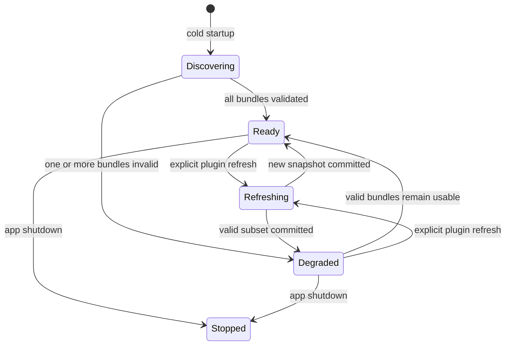
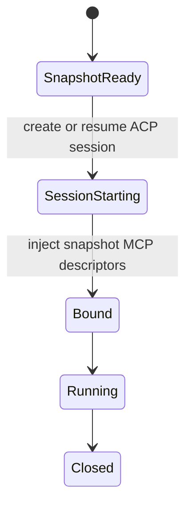

# Codex / ChatGPT plugin compatibility

Status: first runtime slice implemented

## Product contract

OpenMA accepts an unmodified Codex plugin bundle. A plugin author should not
need to add an OpenMA manifest or adapter.

The compatibility entry point is:

```text
<plugin-root>/.codex-plugin/plugin.json
```

This is the current Codex / ChatGPT plugin format. The legacy 2023
`ai-plugin.json` format is not this contract.

For the first local-install surface, users place bundles at:

```text
~/.openma/plugins/<plugin-name>/
```

OpenMA reads the bundle at cold startup. A future Plugins settings surface can
install from Codex-compatible marketplace sources into that directory without
changing the runtime contract.

## Entities

### Plugin bundle

Immutable package content owned by the plugin author:

- `.codex-plugin/plugin.json`
- `skills/`
- `.mcp.json`
- `.app.json`
- `hooks/hooks.json`
- `assets/`

### Installation

OpenMA-owned state that points at a bundle and records whether the user enabled
it. Installation state must not be written back into the bundle.

### Runtime snapshot

A validated, immutable process snapshot of enabled plugin capabilities. Real
ACP sessions read this snapshot; they never discover or validate plugin files.

### Session binding

The capabilities actually passed to one ACP session:

- configured user MCP servers;
- enabled plugin MCP servers;
- the read-only OpenMA Plugin Skills MCP server;
- the task-scoped OpenMA Browser MCP server.

## Lifecycle



Discovery failure is isolated per bundle. One malformed plugin must not prevent
other plugins or the app from starting.



There is no plugin scan, install, update, or probe between `SessionStarting`
and `Running`.

## Capability routing

### MCP servers

The manifest `mcpServers` field points at one or more `.mcp.json` files.
OpenMA accepts all shapes found in the current documentation and official
bundles:

```json
{ "docs": { "command": "docs-mcp", "args": ["--stdio"] } }
```

```json
{ "mcp_servers": { "docs": { "command": "docs-mcp" } } }
```

```json
{ "mcpServers": { "docs": { "command": "docs-mcp" } } }
```

Server ids are namespaced as `plugin:<plugin-name>:<server-name>`. User MCP
configuration wins if it deliberately uses the same id.

ACP's stdio server descriptor has no working-directory field. When a plugin
uses `cwd` in `.mcp.json`, OpenMA resolves plugin-local commands and path
arguments to absolute paths during startup, validates that they remain inside
the bundle, and removes the working-directory dependency before binding the
server to a session.

The same normalized server set is used by:

1. ACP `session/new`, `session/load`, and `session/resume`;
2. the OpenMA MCP Apps companion runtime.

This prevents the agent tool path and the interactive UI resource path from
seeing different plugin configurations.

### Browser capability

Browser use belongs to the OpenMA host, not to a plugin bundle. OpenMA injects
its authenticated, task-scoped Browser MCP descriptor into each session.
Plugin workflows can therefore use browser navigation, interaction, text
extraction, screenshots, and evaluation without shipping a second browser
implementation.

The official Browser plugin currently describes Codex-host-specific
`node_repl` and browser-client APIs. The Plugin Skills bridge replaces that
single host-specific instruction surface with an OpenMA Browser MCP adapter;
other plugin skills remain byte-for-byte authored by their plugin.

The browser descriptor is never persisted in plugin state and never shared
between tasks.

### Skills

Plugin skills are discovered from `SKILL.md` files and retained in the runtime
catalog. ACP has no standard client-to-agent field for installing skills.
OpenMA therefore exposes a host-owned, read-only Plugin Skills MCP server to
every ACP harness. It provides three generic tools:

- search installed plugin skills by task;
- read a matching `SKILL.md`;
- read a relative reference, script, template, or text asset requested by that
  skill.

The bridge does not append full skill instructions or an ever-growing skill
catalog to every user prompt. It also rejects path traversal, symlink escape,
non-files, and files larger than 1 MiB.

### Hooks

Hook files and inline hook definitions are discovered but are not executed by
this slice. Plugin hooks are executable code and require:

- an explicit trust decision tied to the current hook definition;
- `PLUGIN_ROOT` and a separate writable `PLUGIN_DATA`;
- bounded event inputs and outputs;
- cancellation on session or app shutdown;
- audit events.

Installing a plugin must not implicitly trust its hooks.

### Apps and connectors

`.app.json` is discovered. MCP Apps delivered by a bundled MCP server already
use the OpenMA sandboxed MCP Apps runtime.

ChatGPT connector ids such as `connector_...` or `plugin_asdk_app_...` depend on
ChatGPT account-side installation and authentication. They cannot be treated as
a local executable. OpenMA must resolve them through a connector provider or
fall back to the plugin's `.mcp.json` endpoint.

### Harness-native extensions

Harness-native extension systems stay owned by their harness. They are not
copied into `~/.openma/plugins` and are not rewritten as Codex plugins.

For example, `npm:@injaneity/pi-computer-use` is installed into Pi with
`pi install`. A real OpenMA session reaches its registered tools through:

```text
OpenMA session -> pi-acp -> Pi extension runtime -> native helper
```

The cold-start ACP probe proves that `pi-acp` can create a disposable session
and reports its models, modes, config options, auth state, and available slash
commands. Extension tools such as `find_roots` are harness-internal model
tools, not ACP slash commands, so their absence from
`available_commands_update` does not mean the extension is unavailable.

Computer-use readiness is verified separately by a real, opt-in Electron E2E:
the composer starts a Pi turn, Pi invokes `find_roots`, the native helper
returns macOS roots, ACP emits the tool events, and the renderer displays both
the tool call and final response. This test is opt-in because it requires a
configured model account and macOS Accessibility permissions:

```sh
pnpm test:e2e:real:pi-computer-use
```

## Compatibility matrix

| Capability | Current state | Runtime behavior |
| --- | --- | --- |
| `.codex-plugin/plugin.json` | Supported | Validated at startup |
| Relative path containment | Supported | Traversal and symlink escapes rejected |
| `skills` paths | Supported | Search/read bridge injected into ACP sessions |
| `.mcp.json` stdio | Supported | Injected into ACP sessions |
| Plugin-local MCP `cwd` | Supported | Commands and path arguments normalized at startup |
| `.mcp.json` HTTP / SSE | Supported | Injected into ACP sessions and MCP Apps |
| MCP Apps UI | Supported | Sandboxed host runtime |
| OAuth-backed remote MCP | Recognized | OAuth requirement retained; auth broker pending |
| `.app.json` connectors | Discovered | Provider/auth resolution pending |
| Browser workflows | Supported | Task-scoped OpenMA Browser MCP |
| Pi native extensions | Harness-owned | Loaded by Pi and surfaced through `pi-acp` |
| `pi-computer-use` | E2E verified | Pi tool calls reach the native macOS helper |
| Plugin hooks | Discovered | Disabled until trust runtime lands |
| Marketplace install/update | Pending | Runtime already consumes unmodified bundles |

## Security invariants

1. Every manifest path starts with `./`, resolves inside the plugin root, and
   remains inside it after symlink resolution.
2. Bundle discovery is read-only.
3. Plugin MCP ids are namespaced.
4. Browser access is authenticated and task-scoped.
5. Hook discovery does not imply hook trust or execution.
6. A malformed plugin is skipped without aborting startup.
7. Session startup reads a stable snapshot and performs no plugin lifecycle
   work.
