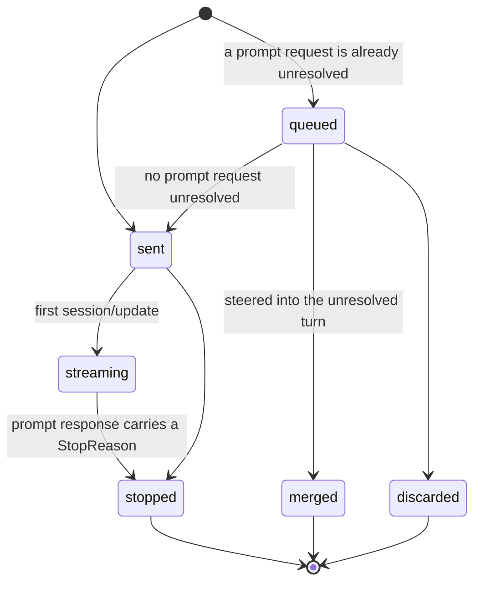
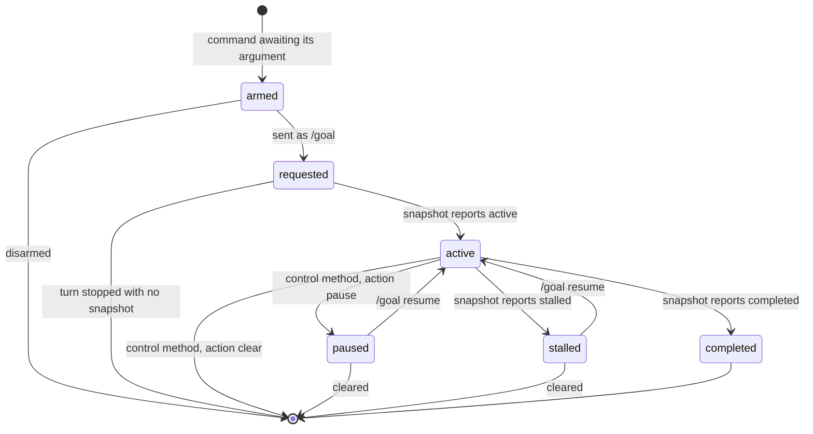
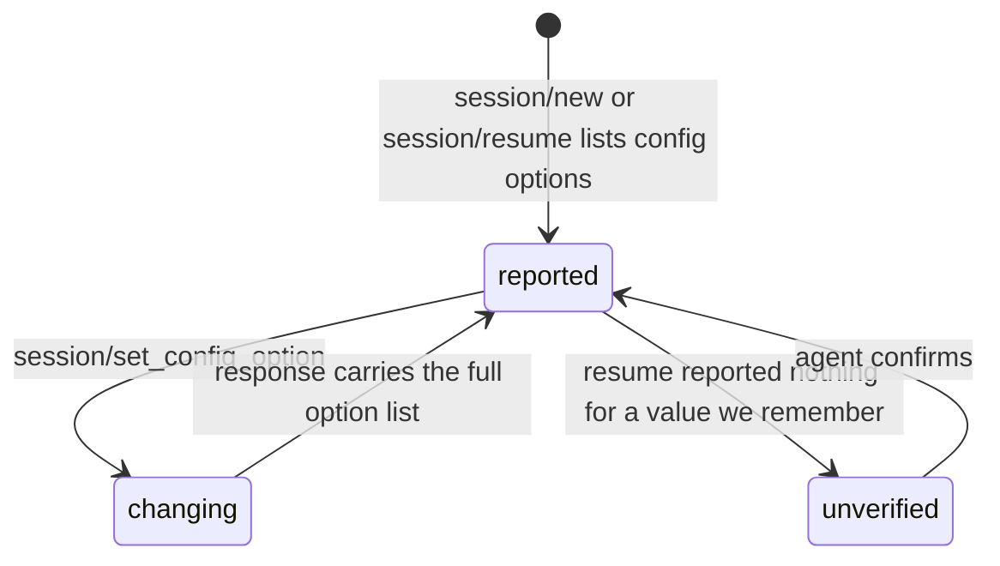
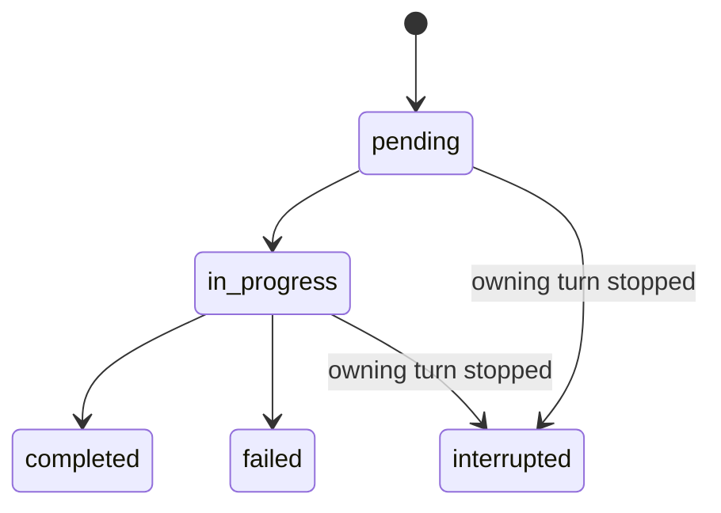

# Turn Lifecycle and State Ownership

Why this document exists: a run of GUI defects — a tool call spinning forever
after its process died, a plan chip claiming a mode the agent had reset, a goal
chip that never appeared, a prompt queue that stopped draining, a new message
rendered inside an earlier turn's output — all had the same shape. None was a
misreading of the protocol. Each was a copy of agent state that outlived or
contradicted the agent. This is the map of who owns what, so a fix can be made
at the seam that is actually wrong instead of the nearest symptom.

## 1. Sources of truth, ranked

1. **The official ACP v1 specification.** Method names, payload shapes,
   lifecycle timing, and required client behaviour come from here and nowhere
   else. Pages relied on below: Prompt Turn, Tool Calls, Session Setup, Session
   Config Options, Slash Commands, Cancellation.
2. **Recorded traffic from the agent we actually run** — the `events` table in
   `~/.oma/sessions.db`, whose `data` column holds the raw `session/update`
   payloads. This outranks any bundled source.
3. **The vendored adapter under `node_modules`** — secondary evidence only, and
   demonstrably not always the build in use: it nests the goal snapshot under
   `_meta.codex.goal` and names the control method
   `_codex/session/goal_control`, while recorded traffic from the running build
   publishes `_meta.goal` with `controlMethod: "_session/goal"`. Reading only
   the vendored copy is how the goal chip came to look for a field that never
   arrives.

When 2 and 3 disagree, 2 wins and the discrepancy gets written down.

## 2. The ACP prompt turn, as specified

A turn is one `session/prompt` request and its response. Nothing else opens or
closes it.

1. The client sends `session/prompt`.
2. The agent reports output through `session/update` notifications.
3. The agent MAY request permission through `session/request_permission`.
4. **The turn ends when the agent responds to that original request with a
   `StopReason`.** The response is the boundary; there is no notification that
   means "done".

`StopReason` is one of `end_turn`, `max_tokens`, `max_turn_requests`,
`refusal`, `cancelled`.

### 2.1 Cancellation duties belong to the client

The spec assigns work to the client, not just the agent:

- The client MAY cancel at any time with a `session/cancel` notification.
- The client **SHOULD preemptively mark all non-finished tool calls pertaining
  to the current turn as cancelled** as soon as it sends that notification.
- The client **MUST** answer every pending `session/request_permission` with the
  cancelled outcome.
- The agent still responds to the prompt request, with `stopReason: "cancelled"`.

This matters for a defect we hit: `ToolCallStatus` has only `pending`,
`in_progress`, `completed`, `failed`, so an interrupted call has no terminal
wire status. Settling it client-side is not an invention working around the
protocol — it is the protocol's instruction. Our implementation goes one step
further than the letter of it, settling on any turn that stopped running rather
than only on a cancel we sent, because a killed agent process produces the same
orphaned rows and the same events replay from disk afterwards.

## 3. What codex-acp adds on top

These are adapter extensions. ACP v1 has no field for any of them, so nothing
here may be inferred from a command's *name*, and nothing here may be assumed
of another harness.

| Concept | Transport | Shape |
| --- | --- | --- |
| Plan mode | `session/set_config_option` | config option `collaboration_mode`, values `default` / `plan`; the command catalogue advertises it in `_meta.commandAction` as `{kind:"setConfigOption", resetValue:"default"}` |
| Goal | prompt text `/goal <objective>` | snapshot pushed as `session_info_update` with `_meta.goal`, carrying `objective`, `status`, `tokensUsed`, `timeUsedSeconds`, `createdAt`, and `controlMethod` |
| Goal control | the method the snapshot names | `{sessionId, action}`; the running build accepts `pause` and `clear`. `resume` is reachable only as prompt text `/goal resume` |
| Command interception | inside `session/prompt` | the adapter parses the prompt text server-side, so `/goal x` is an ordinary prompt on the wire |

Two consequences that keep being missed:

- **Plan and goal are not the same kind of thing.** Plan is a *configuration
  value*: it flips, it has a reset value, and it starts no turn. Goal is an
  *activity*: it is set by a prompt, it has a status of its own, it reports
  elapsed time, and it can be paused, cleared, or stall. Treating them as one
  layer with two transports is right for entering and leaving; it is wrong for
  lifecycle.
- **A goal can outlive the turn that set it.** The snapshot's status is
  independent of any `StopReason`, and the adapter carries its own notion of
  which turn a goal started. Anything in the host that assumes "one prompt in
  flight, and its end is the end of the work" has no state for this.

## 4. The three representations we hold

| Layer | Holds | Where |
| --- | --- | --- |
| ACP session | the prompt request and its `StopReason` | the agent |
| Main process | `activePromptTurnId`, `queuedPrompts`, `steeringPromptTurnIds`, host turn ids | `src/main/session-manager.ts` |
| Renderer | `Turn` reduced from persisted events, `status`, `thoughtText`, tool entries | `src/renderer/src/lib/session-store.ts`, `reduce-turn` |

Two of these are ours, and both contain states ACP does not have — `queued` and
`steering` are host inventions with no wire representation. That is legitimate:
a queue is a client feature. What is not legitimate is deriving facts the agent
already told us.

**`stopReason` currently stops at the main process.** It is read at
`src/main/session-manager.ts:1441` and forwarded as `stop_reason` on an event,
and `src/renderer/src/lib/session-store.ts` never mentions it. So the renderer
decides "is this turn still running" by reducing events, which is a guess about
something the agent stated outright. Every ordering and placeholder defect in
the transcript traces back to that guess.

## 5. Invariants

These are the rules a change has to keep. Each is meant to be a contract test,
not a comment.

**I1 — The agent's word is the turn's end.** A turn is running until its prompt
request resolves. The renderer must learn a turn's terminal state from the
reported `StopReason`, never by inferring it from the absence of events.

**I2 — Nothing renders inside a turn that has not ended.** A prompt accepted
while an earlier turn is unresolved is queued or steered; its bubble may not
appear before that turn's last output.

**I3 — While a turn is unresolved, the transcript says so.** Assistant text
arriving does not mean the turn finished, so text may not silently replace the
running indicator. A user who cannot tell whether output stopped will send a
second message, which is how the ordering defect was found.

**I4 — A queue's visible rows and its count come from one source.** The
composer claiming "1 queued…" while no row is shown is two reads of two states.

**I5 — A host queue may only gate on host facts.** The queue releases the next
prompt when no prompt request is unresolved. It may not stay closed because an
*agent-side activity* is still going: a goal that spans turns is not a prompt in
flight.

**I6 — An agent-side activity gets its own state.** Goal status, elapsed time,
and pause/clear/stall live outside the turn machine. Presentation for it must
not be derived from turn status, and its clock must be derived from a start
time, because a reported total cannot advance between snapshots.

**I7 — Unverified state is not displayed as live.** On resume, config the agent
did not confirm is not shown as current. Applies equally to a mode, a model, and
a goal.

**I8 — A control that cannot act does not render.** A permanently disabled
button is a claim that the action exists. Either wire it or omit it.

**I9 — Orphaned tool calls are settled, not fabricated.** A call left
mid-flight when its turn stopped is presented as interrupted. The underlying
event keeps the last status the agent actually reported; the settling is
presentation, and no terminal status is invented in the event log.

**I10 — Adapter knowledge is keyed by harness and read from data.** Anything in
§3 is looked up by agent id and by the field the agent published, never by
matching a command name.

## 6. Corrected state machines

### 6.1 PromptTurn — one per `session/prompt`

`stopped` carries the reason (`end_turn`, `max_tokens`, `max_turn_requests`,
`refusal`, `cancelled`). There is no `complete` versus `error` split at this
level: a refusal and a token limit are both a turn that stopped, and the reason
is the payload. Entering `stopped` is what settles orphaned tool calls (I9) and
what releases the queue (I5).

### 6.2 SessionActivity — a goal, independent of turns

`armed` is a host state with no wire form: it exists so a bare `/goal` does not
become an error turn. It ends when the activity it was entering appears, or when
a turn came and went without one, which means the agent rejected the argument.
Everything after `requested` is the agent's report, never a local assumption.

### 6.3 ConfigState — plan mode

`unverified` is the state that was missing when a restarted agent silently reset
plan mode: the value was displayed as live while the agent was in `default`.
Under I7 that state is either resolved or not shown.

### 6.4 ToolCall

`interrupted` is presentation only — the four wire statuses are exhaustive, and
the spec's cancellation rules make client-side settling the client's job (§2.1).

## 7. Where the code stands against this

Recorded so the next change can tell a known gap from a new regression. Items
under investigation are marked; do not treat them as settled findings.

- **I1 violated.** `stopReason` never reaches the renderer (§4).
- **I2 violated, cause identified, unfixed.** Turns are ordered by `startedAt`,
  a client-side `Date.now()`, and a turn synthesized on its first event can take
  a later stamp than one registered after it, which puts a new prompt inside an
  earlier turn's output. Sequence, not wall clock, is the ordering.
- **I3 violated, unfixed.** `shouldShowTransientThought` requires
  `!hasVisibleContent`, so the first assistant token removes the only sign that
  more is coming. An attempt to show the indicator for any running turn broke
  three tests that forbid a generic thinking heading above live activity; the
  reconciliation is that a turn with content needs a trailing continuation
  marker inside its activity block, not a heading above it.
- **I5 violated, reproduced.** `src/main/session-manager-prompt-queue.test.ts`
  → "drains the queue once an out-of-band steering turn ends" hangs: when the
  agent answers a steer by opening a turn of its own, the queue is never
  released. It is a standing red, kept because it is the only executable
  evidence of the defect. Two dead ends are recorded so they are not retried:
  the settle path waits for an idle *edge* after the turn is confirmed, and
  remembering the last status as a level did not release it; and widening
  `#drainPromptQueue` to also gate on `outOfBandSteeringTurn` cannot help, since
  adding a block condition can only reduce the chances of draining.
- **I4 — unproven.** The composer showed "1 queued…" with no rows. The count and
  the rows are read in different places; no trace yet.
- **I6 partially held.** The clock derives from `createdAt` and ticks; goal
  presentation still borrows the progress row built for turns.
- **I7 held for config options; the restore mechanism was deliberately removed**
  after the reference client was found to reset plan mode on restart too, so the
  agreed behaviour is to reset, not to restore.
- **I8 held** for the goal edit control.
- **I9 held.**
- **I10 held** for plan, goal, and the sent-as-goal annotation.

## 8. Rules for changing any of this

1. Cite the spec page or a recorded event before changing lifecycle behaviour.
   The vendored adapter is not a citation.
2. If a fix widens a guard, say which invariant makes the widened guard correct.
   A guard loosened to make a symptom disappear is how state machines rot.
3. New adapter knowledge goes in a table keyed by harness, next to the existing
   ones, never in a condition on a command name.
4. A model's sentence in a reply is not a protocol constraint. Editing a goal
   was made destructive by treating "there is already an unfinished goal" from
   an assistant message as a rule; the adapter overwrites without complaint.
5. Verify every new test by reverting the fix and confirming the test fails.
